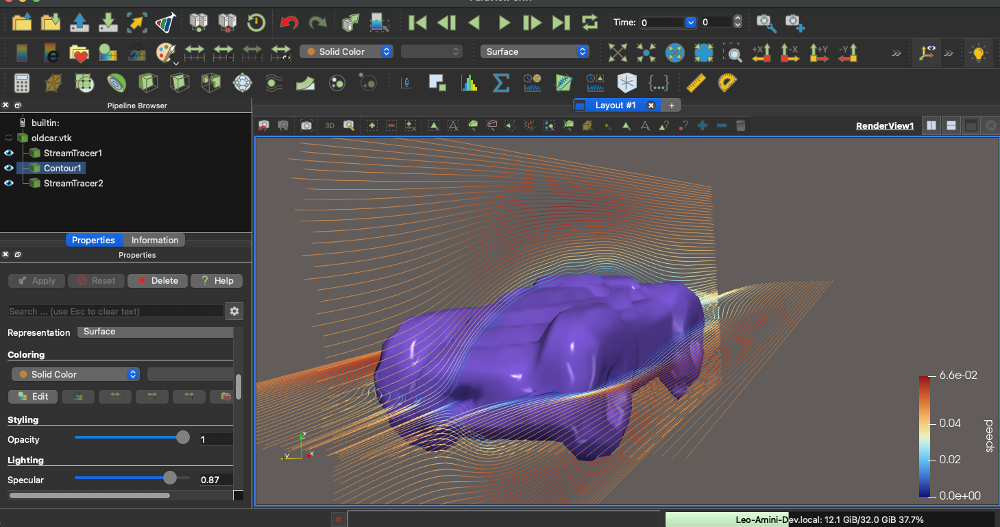
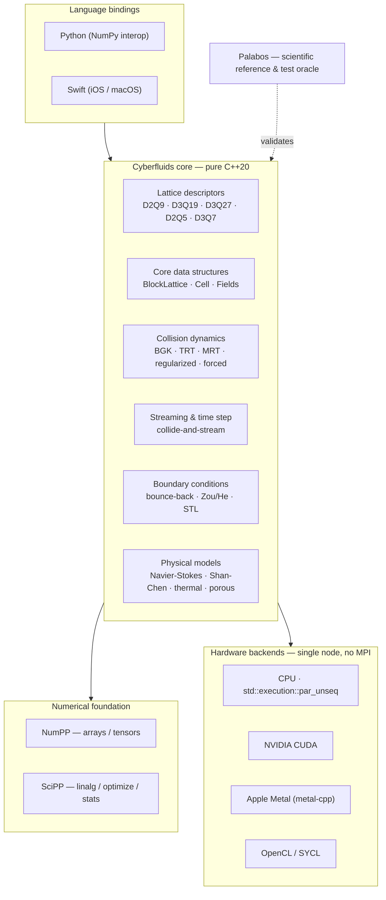
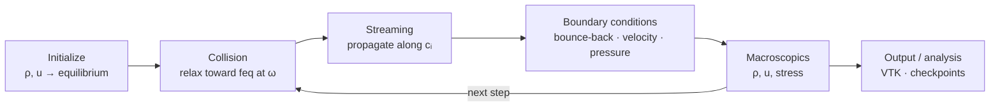

<div align="center">

# 🌊 Cyberfluids

**A next-generation, zero-legacy Computational Fluid Dynamics engine — the Lattice Boltzmann Method in pure, modern C++20.**


</div>

---

Cyberfluids is a **Lattice Boltzmann Method (LBM)** CFD library written from the absolute
zero in **pure C++20**. It borrows the *consecrated physics* of
[Palabos](https://gitlab.com/unigespc/palabos) as its scientific reference — but none of
its legacy code. All numerical data handling flows through the CyberdyneCorp scientific
suite: **[NumPP](https://github.com/CyberdyneCorp/NumPP)** (a C++20 port of NumPy) and
**[SciPP](https://github.com/CyberdyneCorp/SciPP)** (a C++20 port of SciPy).

The result is an ultra-clean, modular simulation engine natively optimized to run
everywhere from **supercomputers and desktop GPUs down to phones and tablets** — with **no
MPI** and **no generic third-party math libraries**.

> **Status: alpha — foundational MVP implemented and Palabos-validated.** Built spec-first
> with [OpenSpec](https://openspec.dev); the full target contract lives in
> [`openspec/specs/`](openspec/specs). The
> [`bootstrap-cyberfluids-core`](openspec/changes/bootstrap-cyberfluids-core) change delivers
> a working slice: D2Q9/D3Q19 descriptors, BGK collision, streaming, bounce-back + Zou/He +
> periodic boundaries, a CPU (`std::execution`) backend, 2D/3D lid-driven cavities, Python +
> Swift bindings, and a Palabos oracle regression test. The examples below use the **real
> API**. Capability status is tracked in the [feature overview](docs/features.md).

## 🏎️ See it in action

<div align="center">



</div>

Steady-state flow past an imported **STL car** in the Cyberfluids wind tunnel (Re ≈ 100):
the mesh is voxelized onto a D3Q19 lattice and enforced as no-slip via partial bounce-back,
then the flow is driven by a free-stream inlet. Streamlines are colored by speed and
rendered in ParaView from the exported VTK. Reproduce it end-to-end from Python:

```bash
python examples/wind_tunnel.py --stl your_model.stl --resolution 48 --out car.vtk
# open car.vtk in ParaView → Contour on 'solid' (body) + Stream Tracer on 'velocity'
```

## ✨ Highlights

- **Zero-legacy C++20** — Concepts, Ranges, smart pointers, contiguous data. No raw owning
  pointers, no legacy macros.
- **CyberdyneCorp ecosystem** — NumPP tensors store the LBM populations; SciPP (linear algebra,
  optimization, statistics) is wired into the build for the numerical work ahead. One coherent
  numerical style.
- **Single-node extreme performance, no MPI** — `std::execution::par_unseq` saturates every
  CPU core; code shaped for auto-vectorization (AVX-512, ARM Neon).
- **Hardware abstraction** — the fluid physics is fully decoupled from the compute driver.
  Switch CPU ⇄ GPU without touching the model equations.
- **Multi-platform** — desktop/server, iOS/iPadOS (Apple Silicon + A-series), Android NDK.
- **Palabos as a numerical oracle** — results are regression-tested against Palabos within a
  documented tolerance.

## 🏗️ Architecture



## 🔁 The LBM simulation loop



## 🚀 Quick start

```bash
git clone https://github.com/CyberdyneCorp/Cyberfluids.git
cd Cyberfluids
scripts/bootstrap_deps.sh                        # build + install NumPP into .deps/
cmake -B build -DCMAKE_BUILD_TYPE=Release        # CPU backend on by default
cmake --build build -j
ctest --test-dir build                           # full suite: core, cavity, oracle, thermal, multiphase, bindings
```

`scripts/bootstrap_deps.sh` expects a NumPP checkout beside this repo (or pass its path);
it installs NumPP into `.deps/` where CMake's `find_package` picks it up.

Run the demos and the Palabos-oracle regression directly:

```bash
./build/examples/cavity2d 128 20000            # writes cavity2d_centerlines.csv
ctest --test-dir build -R oracle_cavity --output-on-failure
```

### 🛠️ With `just` (recommended)

A [`justfile`](justfile) wraps the common workflows and handles the platform quirks (Linux TBB
linking, CUDA PTX arch) for you:

```bash
just bootstrap        # build + install NumPP into .deps/
just test             # configure + build + full CTest suite (CPU)
just gpu-detect       # which GPU backends does this host have?
just gpu              # auto-enable every GPU backend present, build + test
just cuda             # build + test the CUDA wind tunnel
just opencl           # build + test the OpenCL wind tunnel
just bench            # throughput: CPU vs enabled GPU backends (GLUPS)
```

### GPU backends

The **CUDA** and **OpenCL** D3Q19 wind-tunnel solvers are real device-kernel paths, validated
to ~1e-5 vs the fp64 CPU oracle (see [docs/backends.md](docs/backends.md)). **Metal** (Apple
Silicon) accelerates a D2Q9 BGK lid-driven cavity. Enable them explicitly, or let `just gpu`
detect what's available:

```bash
cmake -B build -DCYBERFLUIDS_CUDA=ON             # NVIDIA (nvcc + driver)
cmake -B build -DCYBERFLUIDS_OPENCL=ON           # any OpenCL 1.2+ device
cmake -B build -DCYBERFLUIDS_METAL=ON            # Apple Silicon (Metal)
```

## 💻 Examples

The 2D lid-driven cavity, driven from each language through one shared core. All three
produce identical results.

### C++

```cpp
#include <cyberfluids/solver/lid_driven_cavity.hpp>

using namespace cyberfluids;

int main() {
    // 2D lid-driven cavity: D2Q9, BGK, moving-wall lid. Re = U*N/nu.
    solver::LidDrivenCavity2D<> cav(/*nx=*/256, /*ny=*/256,
                                    /*omega=*/1.0 / 0.6, /*lidVelocity=*/0.05);
    cav.run(20'000);                              // collide-and-stream on std::execution::par_unseq

    auto u = cav.velocity(128, 128);              // {ux, uy} at the center
    cav.writeCenterlines("cavity2d.csv");
}
```

### Python

```python
import cyberfluids as cf
import numpy as np

# Fields come back as NumPy arrays mirroring the NumPP-backed C++ fields.
cav = cf.Cavity2D(256, 256, omega=1 / 0.6, lid_velocity=0.05)
cav.run(20_000)

u = cav.velocity()                               # np.ndarray, shape (256, 256, 2)
print("max speed:", np.linalg.norm(u, axis=-1).max())
```

### Swift

```swift
import Cyberfluids

let cav = Cavity2D(nx: 256, ny: 256, omega: 1.0 / 0.6, lidVelocity: 0.05)!
cav.run(steps: 20_000)

let u = cav.velocity()                           // [Double], length nx*ny*2 (row-major)
```

See [`bindings/README.md`](bindings/README.md) for building and linking the bindings.

### Wind tunnel from an STL

Load a mesh, voxelize it, run external flow past it, and export a VTK for ParaView — the same
core from either language. STL loading needs a geometry-enabled build
(`cmake -B build -DCYBERFLUIDS_GEOMETRY=ON`, which pulls in
[CyberMeshGenerator](https://github.com/CyberdyneCorp/CyberMeshGenerator)); the analytic-sphere
obstacle works in any build.

#### Python

```python
import cyberfluids as cf
import numpy as np

# Voxelize an STL and run flow at Reynolds 100 (inflow speed 0.05 lattice units).
omega = cf.WindTunnel.omega_for_reynolds(u_in=0.05, l_char=48, re=100)
tunnel = cf.WindTunnel.from_stl("car.stl", resolution=48, u_in=0.05, omega=omega)
tunnel.run(15_000)

vel = tunnel.velocity()                          # np.ndarray, shape (nx, ny, nz, 3)
print("max speed:", np.linalg.norm(vel, axis=-1).max())
tunnel.write_vtk("car.vtk")                      # ParaView: Contour 'solid' + Stream Tracer 'velocity'

# No mesh? An analytic sphere works with any build:
#   t = cf.WindTunnel(128, 64, 64, omega=omega, u_in=0.05); t.set_sphere(36, 32, 32, 10)
```

Or straight from the shell via the bundled example:

```bash
python examples/wind_tunnel.py --stl car.stl --resolution 48 --reynolds 100 --out car.vtk
```

#### Swift

```swift
import Cyberfluids

// Voxelize an STL and run flow at Reynolds 100.
let omega = WindTunnel.omegaForReynolds(inflow: 0.05, lChar: 48, re: 100)
guard let tunnel = WindTunnel.fromSTL("car.stl", resolution: 48, inflow: 0.05, omega: omega) else {
    fatalError("STL support needs a geometry-enabled build (-DCYBERFLUIDS_GEOMETRY=ON)")
}
tunnel.run(steps: 15_000)

let u = tunnel.velocity()                        // [Double], length nx*ny*nz*3 (row-major)
tunnel.writeVTK("car.vtk")                       // open in ParaView
```

## 📊 Status at a glance

Cyberfluids runs on **CPU** (`std::execution::par_unseq` with a serial fallback), **CUDA** and
**OpenCL** (validated D3Q19 wind-tunnel device kernels, ~30× the parallel CPU on an RTX 5060), and
**Metal** (Apple Silicon, D2Q9 cavity); SYCL sits behind the locked backend seam. The physics —
BGK/TRT/MRT (2D **and** 3D)/regularized/forced dynamics, Shan-Chen multiphase, thermal Boussinesq,
porous media, and STL geometry with off-lattice bounce-back — is implemented and validated.

- **[Feature overview & status →](docs/features.md)** — capability-by-capability, linked to specs
- **[Backends →](docs/backends.md)** — the CPU/GPU matrix and how backend switching works

## 📚 Documentation

| Doc | What it covers |
|---|---|
| [Getting started](docs/getting-started.md) | Build, dependencies, running the oracle tests |
| [Architecture](docs/architecture.md) | Layers, abstraction seams, data flow |
| [Features](docs/features.md) | Capability-by-capability overview & status |
| [Backends](docs/backends.md) | CPU and GPU backends, how switching works |
| [Benchmarks](docs/benchmarks.md) | Throughput (GLUPS) reference results across backends |
| [Oracle validation](docs/oracle-validation.md) | How Palabos is used to validate results |
| [Bindings](bindings/README.md) | Building and using the Python and Swift bindings |
| [Roadmap](docs/roadmap.md) | Release milestones after the MVP |

Full documentation index: [`docs/`](docs/README.md).

## 🧪 Scientific reference & oracle

Cyberfluids mirrors the collision models, equilibria, and boundary schemes validated by the
worldwide LBM community through Palabos. In tests, identical setups run in both codes and
their macroscopic fields are compared within a documented tolerance — see
[oracle validation](docs/oracle-validation.md).

## 🤝 Contributing

Work is spec-driven. Before writing code, read the relevant spec in `openspec/specs/`, and
open changes through the OpenSpec workflow (`/opsx:propose`). Every bug fix ships with a
regression test.

## 📄 License

Cyberfluids is released under the **[MIT License](LICENSE)**. NumPP and SciPP are free (libre)
C++20 libraries; Palabos is used only as a scientific reference and test oracle.
