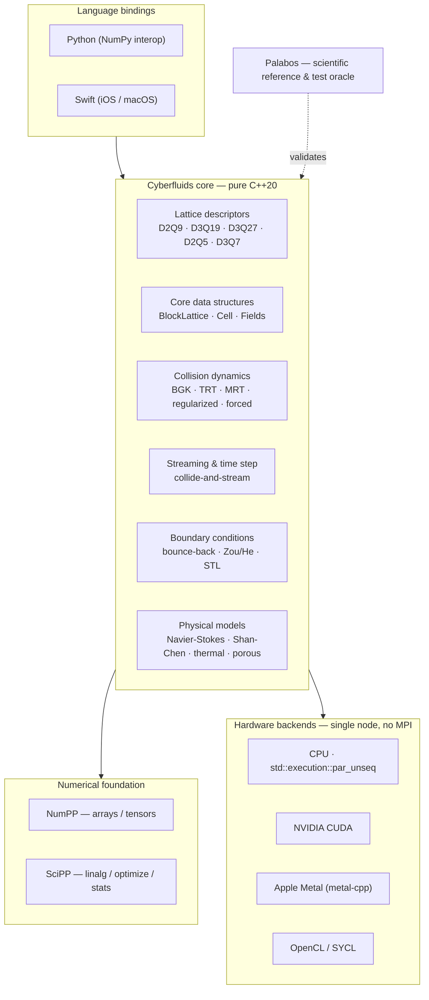
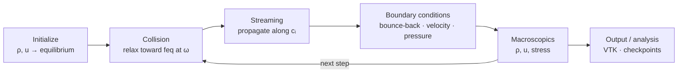

<div align="center">

# 🌊 Cyberfluids

**A next-generation, zero-legacy Computational Fluid Dynamics engine — the Lattice Boltzmann Method in pure, modern C++20.**


</div>

---

Cyberfluids is a **Lattice Boltzmann Method (LBM)** CFD library written from the absolute
zero in **pure C++20**. It borrows the *consecrated physics* of
[Palabos](https://gitlab.com/unigespc/palabos) as its scientific reference — but none of
its legacy code. All numerical data handling flows through the CyberdyneCorp scientific
suite: **[NumPP](https://github.com/CyberdyneCorp/NumPP)** (a C++20 port of NumPy) and
**[SciPP](https://github.com/CyberdyneCorp/SciPP)** (a C++20 port of SciPy).

The result is an ultra-clean, modular simulation engine natively optimized to run
everywhere from **supercomputers and desktop GPUs down to phones and tablets** — with **no
MPI** and **no generic third-party math libraries**.

> **Status: alpha — foundational MVP implemented and Palabos-validated.** Built spec-first
> with [OpenSpec](https://openspec.dev); the full target contract lives in
> [`openspec/specs/`](openspec/specs). The
> [`bootstrap-cyberfluids-core`](openspec/changes/bootstrap-cyberfluids-core) change delivers
> a working slice: D2Q9/D3Q19 descriptors, BGK collision, streaming, bounce-back + Zou/He +
> periodic boundaries, a CPU (`std::execution`) backend, 2D/3D lid-driven cavities, Python +
> Swift bindings, and a Palabos oracle regression test. The examples below use the **real
> API**. Broader physics (TRT/MRT, multiphase, thermal), GPU backends, and STL geometry are
> the planned follow-ups tracked in the [feature table](#-feature-status).

## ✨ Highlights

- **Zero-legacy C++20** — Concepts, Ranges, smart pointers, contiguous data. No raw owning
  pointers, no legacy macros.
- **CyberdyneCorp ecosystem** — NumPP tensors store the LBM populations; SciPP powers
  linear algebra, optimization, and statistics. One coherent numerical style.
- **Single-node extreme performance, no MPI** — `std::execution::par_unseq` saturates every
  CPU core; code shaped for auto-vectorization (AVX-512, ARM Neon).
- **Hardware abstraction** — the fluid physics is fully decoupled from the compute driver.
  Switch CPU ⇄ GPU without touching the model equations.
- **Multi-platform** — desktop/server, iOS/iPadOS (Apple Silicon + A-series), Android NDK.
- **Palabos as a numerical oracle** — results are regression-tested against Palabos within a
  documented tolerance.

## 🏗️ Architecture



## 🔁 The LBM simulation loop



## 🚀 Quick start

```bash
git clone https://github.com/CyberdyneCorp/Cyberfluids.git
cd Cyberfluids
scripts/bootstrap_deps.sh                        # build + install NumPP into .deps/
cmake -B build -DCMAKE_BUILD_TYPE=Release        # CPU backend on by default
cmake --build build -j
ctest --test-dir build                           # full suite: core, cavity, oracle, thermal, multiphase, bindings
```

`scripts/bootstrap_deps.sh` expects a NumPP checkout beside this repo (or pass its path);
it installs NumPP into `.deps/` where CMake's `find_package` picks it up.

Run the demos and the Palabos-oracle regression directly:

```bash
./build/examples/cavity2d 128 20000            # writes cavity2d_centerlines.csv
ctest --test-dir build -R oracle_cavity --output-on-failure
```

Enable the **Metal** GPU backend (Apple Silicon) — a D2Q9 BGK lid-driven cavity on the GPU,
validated to match the CPU solver (CUDA/OpenCL are still stubs):

```bash
cmake -B build -DCYBERFLUIDS_METAL=ON            # builds cyberfluids_metal + the metal_cavity test
```

## 💻 Examples

The 2D lid-driven cavity, driven from each language through one shared core. All three
produce identical results.

### C++

```cpp
#include <cyberfluids/solver/lid_driven_cavity.hpp>

using namespace cyberfluids;

int main() {
    // 2D lid-driven cavity: D2Q9, BGK, moving-wall lid. Re = U*N/nu.
    solver::LidDrivenCavity2D<> cav(/*nx=*/256, /*ny=*/256,
                                    /*omega=*/1.0 / 0.6, /*lidVelocity=*/0.05);
    cav.run(20'000);                              // collide-and-stream on std::execution::par_unseq

    auto u = cav.velocity(128, 128);              // {ux, uy} at the center
    cav.writeCenterlines("cavity2d.csv");
}
```

### Python

```python
import cyberfluids as cf
import numpy as np

# Fields come back as NumPy arrays mirroring the NumPP-backed C++ fields.
cav = cf.Cavity2D(256, 256, omega=1 / 0.6, lid_velocity=0.05)
cav.run(20_000)

u = cav.velocity()                               # np.ndarray, shape (256, 256, 2)
print("max speed:", np.linalg.norm(u, axis=-1).max())
```

### Swift

```swift
import Cyberfluids

let cav = Cavity2D(nx: 256, ny: 256, omega: 1.0 / 0.6, lidVelocity: 0.05)!
cav.run(steps: 20_000)

let u = cav.velocity()                           // [Double], length nx*ny*2 (row-major)
```

See [`bindings/README.md`](bindings/README.md) for building and linking the bindings.

## ⚙️ Backends

| Backend | Target hardware | Status |
|---|---|---|
| **CPU** (`std::execution::par_unseq`) | All x86-64 (AVX-512) & ARM64 (Neon) | ✅ Implemented (par_unseq + serial fallback) |
| **CUDA** | NVIDIA GeForce / Quadro / Tesla | 📋 Stub (seam locked) |
| **Metal** | Apple Silicon (Mac, iPad) | ✅ D2Q9 BGK cavity (fp32) — Objective-C++ + MSL |
| **OpenCL / SYCL** | AMD, Intel, integrated GPUs | 📋 Stub (seam locked) |

## 📊 Feature status

Authoritative behavior lives in the OpenSpec capability specs (linked). Status reflects
implementation, not specification. Legend: ✅ implemented · 🟡 partial (MVP subset) · 📋 planned.

| Capability | Spec | Status |
|---|---|---|
| NumPP/SciPP foundation | [spec](openspec/specs/numpp-scipp-foundation/spec.md) | 🟡 NumPP integrated (SoA populations, fields); SciPP wired, not yet used |
| Lattice descriptors | [spec](openspec/specs/lattice-descriptors/spec.md) | 🟡 D2Q9 · D3Q19 · D3Q27 · D2Q5 · D3Q7 + forced/advected variants (WithSource planned) |
| Core data structures | [spec](openspec/specs/core-data-structures/spec.md) | ✅ BlockLattice · Cell · Scalar/Tensor fields |
| External fields | [spec](openspec/specs/external-fields/spec.md) | ✅ per-cell force / advection velocity (SoA, zero-cost when absent) + fluid→AD coupling |
| Collision dynamics | [spec](openspec/specs/collision-dynamics/spec.md) | 🟡 BGK · TRT · MRT (D2Q9) · regularized · forced (uniform + per-cell) · advection-diffusion; MRT-3D planned |
| Streaming & time step | [spec](openspec/specs/streaming-and-timestep/spec.md) | ✅ collide / stream / fused collideAndStream |
| Boundary conditions | [spec](openspec/specs/boundary-conditions/spec.md) | 🟡 bounce-back · moving-wall · Zou/He (top) · periodic (STL / all-faces planned) |
| Hardware backends | [spec](openspec/specs/hardware-backends/spec.md) | 🟡 CPU + Metal (D2Q9 cavity, fp32) implemented; CUDA/OpenCL stubs |
| Physical models | [spec](openspec/specs/physical-models/spec.md) | 🟡 Navier-Stokes cavity + AD transport + thermal Boussinesq + Shan-Chen multiphase; porous planned |
| Geometry & I/O | [spec](openspec/specs/geometry-and-io/spec.md) | 🟡 VTK output (ParaView) + centerline CSV; STL/checkpoint planned |
| Language bindings (Python · Swift) | [spec](openspec/specs/language-bindings/spec.md) | ✅ both, over a shared C ABI |
| Platform support | [spec](openspec/specs/platform-support/spec.md) | 🟡 desktop/server (iOS · Android toolchains planned) |
| Oracle validation | [spec (delta)](openspec/changes/bootstrap-cyberfluids-core/specs/oracle-validation/spec.md) | ✅ 2D cavity vs Palabos (~0.8% RMS of U); 3D planned |

**MVP change:** [`bootstrap-cyberfluids-core`](openspec/changes/bootstrap-cyberfluids-core) —
D2Q9+D3Q19, BGK, CPU backend, 2D/3D lid-driven cavity, Palabos oracle, Python/Swift bindings.
See its [tasks](openspec/changes/bootstrap-cyberfluids-core/tasks.md).

## 📚 Documentation

| Doc | What it covers |
|---|---|
| [Getting started](docs/getting-started.md) | Build, dependencies, running the oracle tests |
| [Architecture](docs/architecture.md) | Layers, abstraction seams, data flow |
| [Features](docs/features.md) | Capability-by-capability overview & status |
| [Backends](docs/backends.md) | CPU and GPU backends, how switching works |
| [Oracle validation](docs/oracle-validation.md) | How Palabos is used to validate results |
| [Bindings](bindings/README.md) | Building and using the Python and Swift bindings |
| [Roadmap](docs/roadmap.md) | Release milestones after the MVP |

Full documentation index: [`docs/`](docs/README.md).

## 🧪 Scientific reference & oracle

Cyberfluids mirrors the collision models, equilibria, and boundary schemes validated by the
worldwide LBM community through Palabos. In tests, identical setups run in both codes and
their macroscopic fields are compared within a documented tolerance — see
[oracle validation](docs/oracle-validation.md).

## 🤝 Contributing

Work is spec-driven. Before writing code, read the relevant spec in `openspec/specs/`, and
open changes through the OpenSpec workflow (`/opsx:propose`). Every bug fix ships with a
regression test.

## 📄 License

License **TBD**. NumPP and SciPP are free (libre) C++20 libraries; Palabos is used only as a
scientific reference and test oracle.
