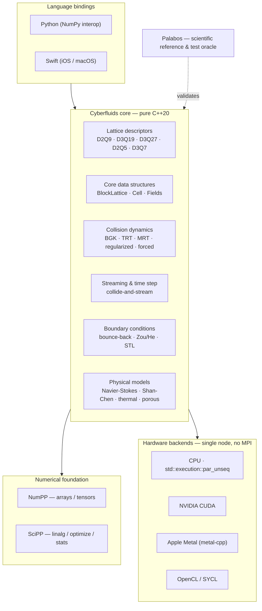
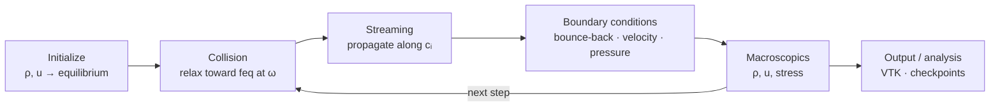

<div align="center">

# 🌊 Cyberfluids

**A next-generation, zero-legacy Computational Fluid Dynamics engine — the Lattice Boltzmann Method in pure, modern C++20.**


</div>

---

Cyberfluids is a **Lattice Boltzmann Method (LBM)** CFD library written from the absolute
zero in **pure C++20**. It borrows the *consecrated physics* of
[Palabos](https://gitlab.com/unigespc/palabos) as its scientific reference — but none of
its legacy code. All numerical data handling flows through the CyberdyneCorp scientific
suite: **[NumPP](https://github.com/CyberdyneCorp/NumPP)** (a C++20 port of NumPy) and
**[SciPP](https://github.com/CyberdyneCorp/SciPP)** (a C++20 port of SciPy).

The result is an ultra-clean, modular simulation engine natively optimized to run
everywhere from **supercomputers and desktop GPUs down to phones and tablets** — with **no
MPI** and **no generic third-party math libraries**.

> **Status: pre-alpha / specification phase.** The library is being built spec-first with
> [OpenSpec](https://openspec.dev). The full target contract lives in
> [`openspec/specs/`](openspec/specs); the first implementable slice is the
> [`bootstrap-cyberfluids-core`](openspec/changes/bootstrap-cyberfluids-core) change.
> The code examples below show the **preview API** and are not yet implemented.

## ✨ Highlights

- **Zero-legacy C++20** — Concepts, Ranges, smart pointers, contiguous data. No raw owning
  pointers, no legacy macros.
- **CyberdyneCorp ecosystem** — NumPP tensors store the LBM populations; SciPP powers
  linear algebra, optimization, and statistics. One coherent numerical style.
- **Single-node extreme performance, no MPI** — `std::execution::par_unseq` saturates every
  CPU core; code shaped for auto-vectorization (AVX-512, ARM Neon).
- **Hardware abstraction** — the fluid physics is fully decoupled from the compute driver.
  Switch CPU ⇄ GPU without touching the model equations.
- **Multi-platform** — desktop/server, iOS/iPadOS (Apple Silicon + A-series), Android NDK.
- **Palabos as a numerical oracle** — results are regression-tested against Palabos within a
  documented tolerance.

## 🏗️ Architecture



## 🔁 The LBM simulation loop



## 🚀 Quick start (preview)

Cyberfluids builds with CMake and fetches NumPP/SciPP automatically.

```bash
git clone https://github.com/CyberdyneCorp/Cyberfluids.git
cd Cyberfluids
cmake -B build -DCMAKE_BUILD_TYPE=Release        # CPU backend on by default
cmake --build build -j
ctest --test-dir build                            # runs the Palabos-oracle regression tests
```

Enable an optional GPU backend (off by default):

```bash
cmake -B build -DCYBERFLUIDS_METAL=ON             # or -DCYBERFLUIDS_CUDA=ON / -DCYBERFLUIDS_OPENCL=ON
```

## 💻 Examples (preview API)

### C++

```cpp
#include <cyberfluids/cyberfluids.hpp>

using namespace cyberfluids;

int main() {
    // 2D lid-driven cavity, Re implied by omega and the lid velocity.
    const std::size_t nx = 256, ny = 256;
    const double omega = 1.0 / 0.6;               // omega = 1 / tau

    BlockLattice2D<double, descriptors::D2Q9> lattice(nx, ny);
    lattice.attributeDynamics(lattice.boundingBox(), BGKdynamics{omega});

    // No-slip walls + a moving lid on the top boundary.
    auto bc = boundary::createLocalBoundaryCondition2D(lattice);
    bc.setVelocityConditionOnBlockBoundaries(lattice);
    bc.setVelocity(topWall(lattice), {0.05, 0.0});

    for (std::size_t step = 0; step < 20'000; ++step)
        lattice.collideAndStream();               // runs on std::execution::par_unseq

    io::writeVTK(lattice, "cavity2d.vti");
}
```

### Python

```python
import cyberfluids as cf
import numpy as np

# Same cavity, driven from Python; fields come back as NumPy arrays (NumPP interop).
lattice = cf.BlockLattice2D(256, 256, descriptor=cf.D2Q9, dtype="float64")
lattice.attribute_dynamics(lattice.bounding_box(), cf.BGKdynamics(omega=1 / 0.6))

bc = cf.boundary.local_2d(lattice)
bc.set_velocity_on_boundaries(lattice)
bc.set_velocity(lattice.top_wall(), (0.05, 0.0))

for _ in range(20_000):
    lattice.collide_and_stream()

u: np.ndarray = lattice.velocity()               # shape (256, 256, 2), zero-copy where possible
print("max speed:", np.linalg.norm(u, axis=-1).max())
```

### Swift

```swift
import Cyberfluids

// Same cavity on Apple Silicon (CPU or Metal backend).
let lattice = BlockLattice2D<Double, D2Q9>(nx: 256, ny: 256)
lattice.attributeDynamics(lattice.boundingBox(), BGKDynamics(omega: 1.0 / 0.6))

let bc = Boundary.localCondition2D(lattice)
bc.setVelocityOnBoundaries(lattice)
bc.setVelocity(lattice.topWall(), .init(x: 0.05, y: 0.0))

for _ in 0..<20_000 {
    lattice.collideAndStream()
}

let u = lattice.velocity()                        // bridged to Swift arrays
print("max speed:", u.magnitude().max() ?? 0)
```

## ⚙️ Backends

| Backend | Target hardware | Status |
|---|---|---|
| **CPU** (`std::execution::par_unseq`) | All x86-64 (AVX-512) & ARM64 (Neon) | 📋 Planned (MVP) |
| **CUDA** | NVIDIA GeForce / Quadro / Tesla | 📋 Planned |
| **Metal** (metal-cpp) | Apple Silicon (Mac, iPad) | 📋 Planned |
| **OpenCL / SYCL** | AMD, Intel, integrated GPUs | 📋 Planned |

## 📊 Feature status

Authoritative behavior lives in the OpenSpec capability specs (linked). Status reflects
implementation, not specification.

| Capability | Spec | Status |
|---|---|---|
| NumPP/SciPP foundation | [spec](openspec/specs/numpp-scipp-foundation/spec.md) | 📋 Planned |
| Lattice descriptors (D2Q9 · D3Q19 · D3Q27 · D2Q5 · D3Q7) | [spec](openspec/specs/lattice-descriptors/spec.md) | 📋 Planned |
| Core data structures | [spec](openspec/specs/core-data-structures/spec.md) | 📋 Planned |
| Collision dynamics (BGK · TRT · MRT · regularized · forced) | [spec](openspec/specs/collision-dynamics/spec.md) | 📋 Planned |
| Streaming & time step | [spec](openspec/specs/streaming-and-timestep/spec.md) | 📋 Planned |
| Boundary conditions | [spec](openspec/specs/boundary-conditions/spec.md) | 📋 Planned |
| Hardware backends | [spec](openspec/specs/hardware-backends/spec.md) | 📋 Planned |
| Physical models (Navier-Stokes · Shan-Chen · thermal · porous) | [spec](openspec/specs/physical-models/spec.md) | 📋 Planned |
| Geometry & I/O (STL · VTK · checkpoint) | [spec](openspec/specs/geometry-and-io/spec.md) | 📋 Planned |
| Language bindings (Python · Swift) | [spec](openspec/specs/language-bindings/spec.md) | 📋 Planned |
| Platform support (desktop · iOS · Android) | [spec](openspec/specs/platform-support/spec.md) | 📋 Planned |

**Active change:** [`bootstrap-cyberfluids-core`](openspec/changes/bootstrap-cyberfluids-core) —
the MVP slice (D2Q9+D3Q19, BGK, CPU backend, lid-driven cavity, Palabos oracle, Python/Swift
scaffolds). See its [tasks](openspec/changes/bootstrap-cyberfluids-core/tasks.md).

## 📚 Documentation

| Doc | What it covers |
|---|---|
| [Getting started](docs/getting-started.md) | Build, dependencies, running the oracle tests |
| [Architecture](docs/architecture.md) | Layers, abstraction seams, data flow |
| [Features](docs/features.md) | Capability-by-capability overview & status |
| [Backends](docs/backends.md) | CPU and GPU backends, how switching works |
| [Oracle validation](docs/oracle-validation.md) | How Palabos is used to validate results |
| [Roadmap](docs/roadmap.md) | Release milestones after the MVP |

Full documentation index: [`docs/`](docs/README.md).

## 🧪 Scientific reference & oracle

Cyberfluids mirrors the collision models, equilibria, and boundary schemes validated by the
worldwide LBM community through Palabos. In tests, identical setups run in both codes and
their macroscopic fields are compared within a documented tolerance — see
[oracle validation](docs/oracle-validation.md).

## 🤝 Contributing

Work is spec-driven. Before writing code, read the relevant spec in `openspec/specs/`, and
open changes through the OpenSpec workflow (`/opsx:propose`). Every bug fix ships with a
regression test.

## 📄 License

License **TBD**. NumPP and SciPP are free (libre) C++20 libraries; Palabos is used only as a
scientific reference and test oracle.
