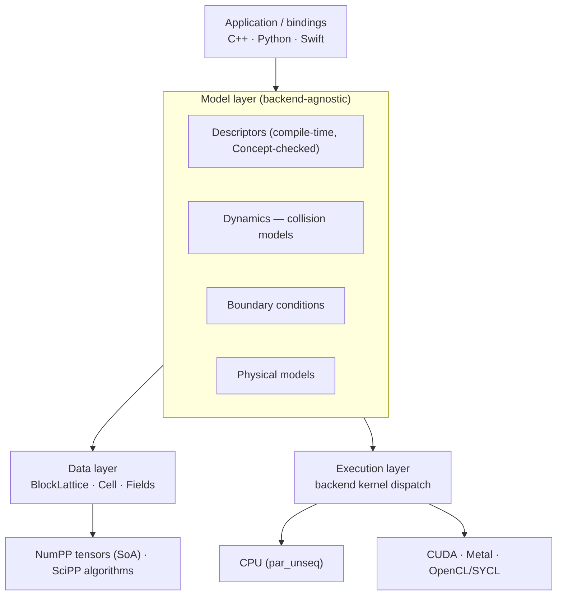

# Architecture

Cyberfluids is layered so that **fluid physics is fully decoupled from the compute driver**.
The same model equations run on any backend without modification.

## Key design decisions

These are recorded in full in the bootstrap change's
[`design.md`](../openspec/changes/bootstrap-cyberfluids-core/design.md).

- **SoA populations in a NumPP tensor** (`[q][cells]`, component-major) so each direction is
  contiguous — good for CPU vectorization and GPU coalescing. A `Cell` is a lightweight
  *view*, not the owner.
- **Descriptors are compile-time types** constrained by a C++20 `LatticeDescriptor` Concept:
  zero runtime cost, readable errors.
- **Backend seam at the loop level** (kernel-launch strategy), not per-cell virtual calls, so
  the CPU path lowers to a single `std::for_each(par_unseq, ...)`.
- **`Dynamics` interface for per-region model selection** (mirrors Palabos), while the hot BGK
  path stays templated/inlinable.
- **Palabos oracle compared offline** — reference fields are produced once by Palabos and
  compared in-process, keeping the test build free of Palabos/MPI.

## Abstraction seams (fixed by the MVP)

| Seam | Purpose |
|---|---|
| `LatticeDescriptor` Concept | Swap velocity stencils without touching collision/streaming |
| `Dynamics<T, Descriptor>` | Select collision model per cell/region |
| Backend kernel dispatch | Swap CPU ⇄ GPU without changing model code |
| C-ABI core surface | Single surface wrapped by both Python and Swift bindings |

## Related specs

- [core-data-structures](../openspec/specs/core-data-structures/spec.md)
- [lattice-descriptors](../openspec/specs/lattice-descriptors/spec.md)
- [hardware-backends](../openspec/specs/hardware-backends/spec.md)
- [streaming-and-timestep](../openspec/specs/streaming-and-timestep/spec.md)
