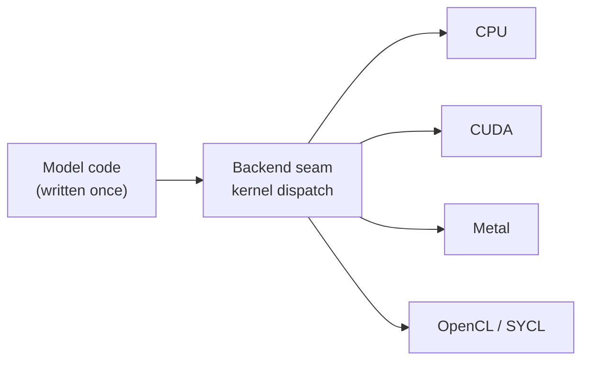

# Backends

Cyberfluids targets a **single node** and deliberately avoids MPI. Parallelism is
intra-node: threads, SIMD, and GPU. The fluid physics never changes when the backend does —
see the [hardware-backends spec](../openspec/specs/hardware-backends/spec.md).

## How switching works

The backend is selected at the **loop level** (who launches the kernel), not per cell. Model
code — dynamics and boundary conditions — is written once and is backend-agnostic. The CPU
path lowers to a single `std::for_each(std::execution::par_unseq, ...)`; GPU backends
implement the same kernel-launch interface.

## Backend matrix

| Backend | Hardware | Enable flag | Notes |
|---|---|---|---|
| **CPU** | x86-64 (AVX-512), ARM64 (Neon) | on by default | `std::execution::par_unseq`; serial fallback when unavailable |
| **CUDA** | NVIDIA GeForce / Quadro / Tesla | `-DCYBERFLUIDS_CUDA=ON` | Dedicated driver for max throughput |
| **Metal** | Apple Silicon (Mac, iPad) | `-DCYBERFLUIDS_METAL=ON` | metal-cpp, pure C++ |
| **OpenCL / SYCL** | AMD, Intel, integrated GPUs | `-DCYBERFLUIDS_OPENCL=ON` | Hardware-agnostic path |

## Guarantees

- Building with **no GPU toolkit** present never breaks the CPU build; GPU code is excluded
  cleanly.
- A GPU run and a CPU run of the same simulation agree within a **documented floating-point
  tolerance**.
- No MPI library or launcher is required to build or run.

Status: all backends are 📋 **Planned**. The CPU backend lands with the MVP; GPU backends
are follow-up changes behind the flags above (seams stubbed in the MVP).
