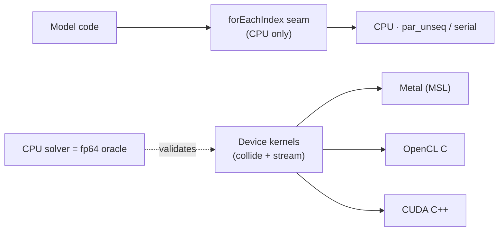

# Backends

Cyberfluids targets a **single node** and deliberately avoids MPI. Parallelism is
intra-node: threads, SIMD, and GPU. The fluid physics never changes when the backend does —
see the [hardware-backends spec](../openspec/specs/hardware-backends/spec.md).

## How it actually works (two distinct mechanisms)

There are **two** parallelism mechanisms, and it's important not to conflate them:

1. **The CPU seam** — `Backend::forEachIndex(n, f)` runs a **host C++ lambda** `f` across
   `[0, n)`, lowering to `std::for_each(std::execution::par_unseq, ...)` (with a serial
   fallback). This is a **CPU-only** abstraction: a host closure cannot be marshalled onto a
   GPU, so this seam does **not** dispatch to devices.

2. **GPU device-kernel solvers** — GPU acceleration is a **bespoke solver per API**, with the
   hot loop (collide + stream) rewritten as device kernels (MSL / OpenCL C / CUDA C++), data
   kept resident on the device across steps. Each is validated against the CPU solver as an
   fp64 oracle. The Metal cavity and the OpenCL/CUDA wind tunnel are built this way — they do
   not go through `forEachIndex`.



## Backend matrix

| Backend | Hardware | Enable flag | Status |
|---|---|---|---|
| **CPU** | x86-64 (AVX-512), ARM64 (Neon) | on by default | ✅ `std::execution::par_unseq` (guarded by `__cpp_lib_parallel_algorithm`) with a serial fallback |
| **OpenCL** | Apple / AMD / Intel / NVIDIA GPUs | `-DCYBERFLUIDS_OPENCL=ON` | ✅ D3Q19 wind tunnel — device kernels validated on Apple M2 Max GPU (~1.35 GLUPS) and NVIDIA RTX 5060 (~1.15 GLUPS); Linf/Uin ~ 1e-5 vs the fp64 CPU oracle |
| **CUDA** | NVIDIA GeForce / Quadro / Tesla | `-DCYBERFLUIDS_CUDA=ON` | ✅ D3Q19 wind tunnel — device kernels validated on NVIDIA RTX 5060 (Blackwell, sm_120 via PTX JIT; Linf/Uin ~ 1e-5 vs the fp64 CPU oracle; ~1.15 GLUPS) |
| **Metal** | Apple Silicon (Mac, iPad) | `-DCYBERFLUIDS_METAL=ON` | ✅ D2Q9 BGK cavity (fp32) — Objective-C++ + runtime MSL kernels |
| **SYCL** | AMD, Intel, integrated GPUs | `-DCYBERFLUIDS_SYCL=ON` | 📋 Planned |

> Note: the `Cuda`/`Metal`/`OpenCL`/`Sycl` structs in `backend/gpu_stubs.hpp` are **not** the
> acceleration path — they only satisfy the `forEachIndex` contract by running the lambda on
> the host (serial), so a flag-enabled build still runs. Real acceleration lives in the
> device-kernel solvers above.

## Guarantees

- Building with **no GPU toolkit** present never breaks the CPU build; GPU code is excluded
  cleanly.
- A GPU run and a CPU run of the same simulation agree within a **documented floating-point
  tolerance** (fp32 device vs fp64 CPU oracle).
- No MPI library or launcher is required to build or run.

Status: the **CPU** path is the always-on baseline. **OpenCL** and **CUDA** are real, validated
GPU wind-tunnel solvers. On an NVIDIA RTX 5060 both reach ~1.15 GLUPS — roughly **30× a fully
parallel 24-thread CPU** (i9-12900K, fp64 `par_unseq` ≈ 0.038 GLUPS). CUDA and OpenCL land within
noise of each other because the D3Q19 step is memory-bandwidth-bound (~78% of the card's DRAM
peak), so both hit the same roofline. Note the GPU paths are fp32 vs the fp64 CPU baseline, so a
same-precision comparison narrows the gap. **Metal** accelerates the 2D cavity. SYCL is planned.

### Reproducing the benchmark

```sh
just gpu-detect     # what GPU backends does this host have?
just bench          # CPU vs enabled GPU backends, default 160×80×80 grid
just bench 256 128 128 300
```

The benchmark (`bench/wind_tunnel_bench.cpp`) times an identical wind-tunnel run per backend and
reports GLUPS (giga lattice-updates/sec) plus the speed-up over the CPU baseline.
