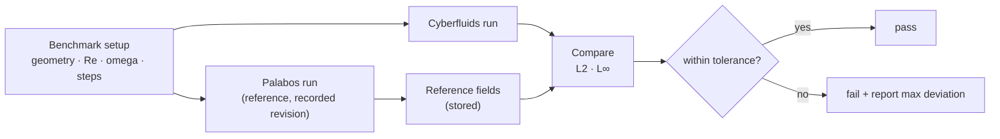

# Oracle validation

Cyberfluids uses **Palabos** as a numerical oracle: for a benchmark, identical physical
setups run in both codes and their macroscopic fields are compared within a documented
tolerance. Authoritative requirements are in the
[oracle-validation spec](../openspec/changes/bootstrap-cyberfluids-core/specs/oracle-validation/spec.md).

## Why an oracle

Palabos's collision models, equilibria, and boundary schemes are validated by the worldwide
LBM community. Rather than re-derive correctness, Cyberfluids proves it **matches** Palabos
on the same inputs.

## How it works

- **Offline comparison.** Palabos produces reference fields once; Cyberfluids compares
  in-process. This keeps the Cyberfluids test build free of Palabos and MPI.
- **Documented tolerance.** Comparison uses explicit absolute/relative tolerances on velocity
  and density over the full field and the cavity centerlines. Starting point: L∞ ≤ 1e-3
  (lattice units) at matched steps, tightened as the implementation matures.
- **Reproducibility.** Parameters, tolerances, and the Palabos revision are recorded so a
  failure is attributable to a specific change.

## First benchmark (implemented)

The [`bootstrap-cyberfluids-core`](../openspec/changes/bootstrap-cyberfluids-core) change
validates a **2D lid-driven cavity** (D2Q9, BGK, 64×64, `omega=1/0.6`, `U=0.05`, Re≈96,
40 000 steps) against Palabos `4127697`.

- **Result:** interior centerline agreement of **L∞ ≈ 0.050** and **L2 ≈ 0.008** (fractions
  of the lid speed). The L∞ peak is the interior node directly below the lid, where
  Cyberfluids' moving-wall bounce-back and Palabos' interpolation BC differ most.
- **Tolerances enforced:** L∞ ≤ 0.07, L2 ≤ 0.015.
- The regression test (`tests/test_oracle_cavity.cpp`) reads the stored reference
  (`tests/oracle/cavity2d_palabos.csv`) and compares in-process — no Palabos/MPI in the
  test build. See [`tests/oracle/README.md`](../tests/oracle/README.md) for parameters and
  how to regenerate the reference.

A 3D (D3Q19) oracle reference is a follow-up. Local Palabos checkout used:
`/Users/leonardoaraujo/work/palabos`.
