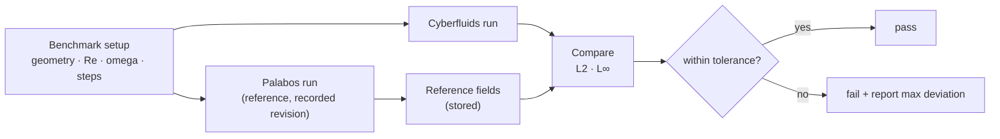

# Oracle validation

Cyberfluids uses **Palabos** as a numerical oracle: for a benchmark, identical physical
setups run in both codes and their macroscopic fields are compared within a documented
tolerance. Authoritative requirements are in the
[oracle-validation spec](../openspec/changes/bootstrap-cyberfluids-core/specs/oracle-validation/spec.md).

## Why an oracle

Palabos's collision models, equilibria, and boundary schemes are validated by the worldwide
LBM community. Rather than re-derive correctness, Cyberfluids proves it **matches** Palabos
on the same inputs.

## How it works

- **Offline comparison.** Palabos produces reference fields once; Cyberfluids compares
  in-process. This keeps the Cyberfluids test build free of Palabos and MPI.
- **Documented tolerance.** Comparison uses explicit absolute/relative tolerances on velocity
  and density over the full field and the cavity centerlines. Starting point: L∞ ≤ 1e-3
  (lattice units) at matched steps, tightened as the implementation matures.
- **Reproducibility.** Parameters, tolerances, and the Palabos revision are recorded so a
  failure is attributable to a specific change.

## First benchmark

The [`bootstrap-cyberfluids-core`](../openspec/changes/bootstrap-cyberfluids-core) change
validates a **lid-driven cavity** in 2D (D2Q9) and 3D (D3Q19) against Palabos. Local Palabos
reference checkout: `/Users/leonardoaraujo/work/palabos`.
